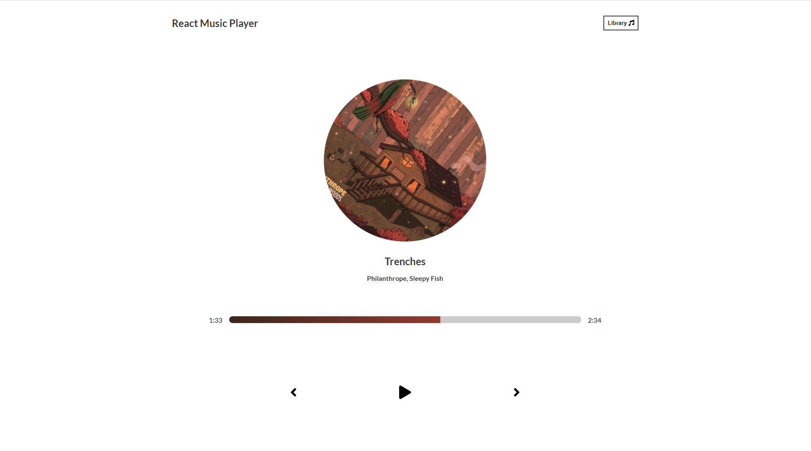
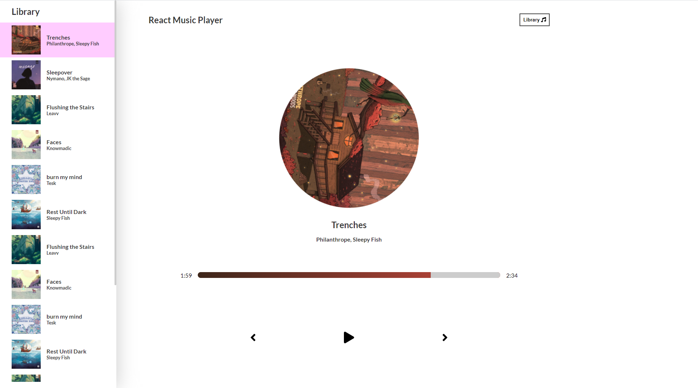

### React Music Player

# How to start
1. Clone or download this repository to your computer.
1. Open your terminal. Navigate to local repository folder. Run `npm install` to get all the dependencies installed.
1. Run `npm start`.
1. Open `http://localhost:3000` in your browser.

## Desktop (1920x1080)

